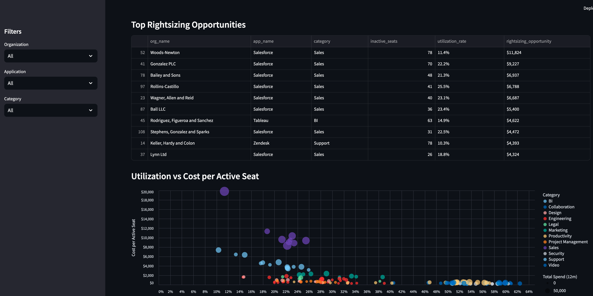

# SaaS Management Zero-Infra Demo

## Seat Intelligence Demo

This repo is a local, zero‑infra demo for SaaS management. We generate
synthetic Okta usage and SaaS spend data, model it in dbt, and surface
insights that help teams rationalize spend, right‑size licenses, and
understand how they compare to peer cohorts. It uses DuckDB + dbt for the
warehouse and a Streamlit app for the UI.

## What’s Inside

- `ramp_analytics/`: dbt project (staging → intermediate → marts)
- `scripts/`: synthetic data generation + ingest into DuckDB
- `warehouse/`: DuckDB file (local)
- `streamlit_app.py`: Seat Intelligence dashboard
- `frontend/`: isolated Streamlit environment

## Local dbt Profile

This repo uses a project-local dbt profile so setup is self-serve.

## Quickstart

Dependencies:

- Python 3.13
- `uv` (Python package manager)

Generate synthetic data (first-time setup):

```bash
uv run python scripts/generate_synthetic_data.py
uv run python scripts/ingest_raw_to_duckdb.py
```

Run dbt with:

```bash
uv run dbt --project-dir ramp_analytics debug
uv run dbt --project-dir ramp_analytics deps
uv run dbt --project-dir ramp_analytics build
```

## Streamlit App

Streamlit runs in a separate uv project to avoid dependency conflicts with dbt.

Setup and run:

```bash
cd frontend
uv sync
uv run streamlit run ../streamlit_app.py
```

Optional: point Streamlit at a different DuckDB file:

```bash
RAMP_DUCKDB_PATH=path/to/ramp.duckdb uv run streamlit run ../streamlit_app.py
```

### Streamlit Example


