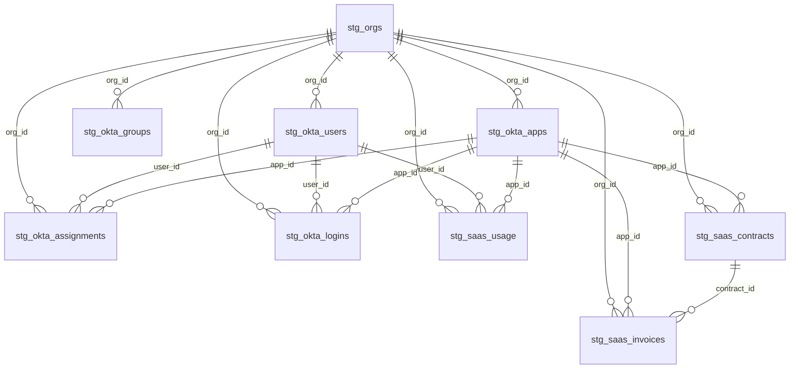

# Staging Layer ERD

```mermaid
erDiagram
  stg_orgs ||--o{ stg_okta_users : org_id
  stg_orgs ||--o{ stg_okta_groups : org_id
  stg_orgs ||--o{ stg_okta_apps : org_id
  stg_orgs ||--o{ stg_okta_assignments : org_id
  stg_orgs ||--o{ stg_okta_logins : org_id
  stg_orgs ||--o{ stg_saas_usage : org_id
  stg_orgs ||--o{ stg_saas_contracts : org_id
  stg_orgs ||--o{ stg_saas_invoices : org_id

  stg_okta_users ||--o{ stg_okta_assignments : user_id
  stg_okta_users ||--o{ stg_okta_logins : user_id
  stg_okta_users ||--o{ stg_saas_usage : user_id

  stg_okta_apps ||--o{ stg_okta_assignments : app_id
  stg_okta_apps ||--o{ stg_okta_logins : app_id
  stg_okta_apps ||--o{ stg_saas_usage : app_id
  stg_okta_apps ||--o{ stg_saas_contracts : app_id
  stg_okta_apps ||--o{ stg_saas_invoices : app_id

  stg_saas_contracts ||--o{ stg_saas_invoices : contract_id
```
